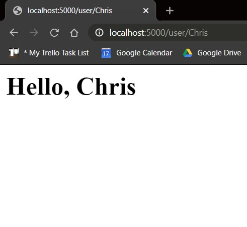

# ECE444-F2020-Lab2

Name: Chris Pua
this repo is a clone of https://github.com/miguelgrinberg/flasky

# Screenshot 1

# Screenshot 2

# Flask Context Globals

Flask context globals are ways to make certain variables globally accessible to a particular thread without interfering with other threads. This way, the current handling function does not require to pass in an additional argument and can treat it as a global variable. This also means every other function in the app also does not require to pass these contexts as additional arguments.